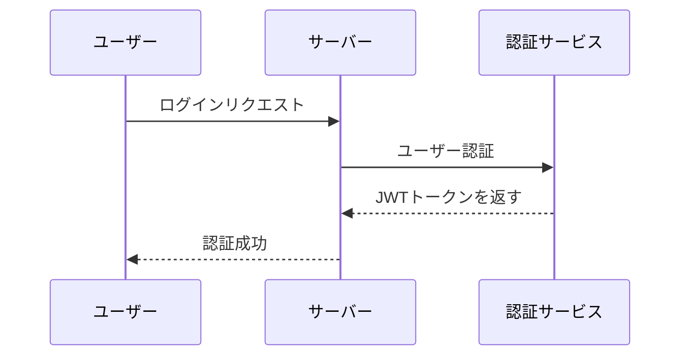

Q1. おはようございます。いま私はお弁当注文システムを設計しています。要件定義をもとにmarkdownファイルでVisualStudioCodeで仕様書を作っています。仕様書にはテーブル定義なども含まれています。テーブル定義はテーブルタグの使用でうまくかけました。そこでですが、JWTログインなどのユーザーのログインシーケンスをUMLのシーケンス図で表現したいです。mdファイルにUMLのシーケンス図の組み込みは可能でしょうか？日本の多数の事業所ではどのようなツールを使うなり、プラグインを組み込むなりしているでしょうか？アドバイスをお願いいたします。

A1. おはようございます！お弁当注文システムの設計、素晴らしいですね。UMLシーケンス図をMarkdownファイルに組み込むことは可能です。以下の方法を試してみてください：

1. **PlantUML**: MarkdownファイルにPlantUMLを使用してUMLシーケンス図を描画できます。PlantUMLは、Markdownファイル内でシンプルなテキストベースの記法を使用して図を描画することができます。

2. **Mermaid**: Mermaidも同様にMarkdownファイルにUMLシーケンス図を描画するためのツールです。シンプルなマークダウン記法を使用して、シーケンス図を簡単に作成できます。

3. **Draw.io**: Draw.io（現在はdiagrams.net）は、オンラインのUMLエディタで、生成した図を画像として保存し、Markdownファイルに埋め込むことができます。

日本の多くの事業所では、上記のツールやプラグインを使用してUMLシーケンス図を作成しています。特にPlantUMLとMermaidは、開発者に人気があります。

もし具体的なサンプルや設定方法が必要でしたら、お知らせください。さらに詳しくお手伝いします！

Q2.
大変ありがとうございます。そこでお聞きしたいのですが、PlantUMLとMermaidの違いといいますか、各々の長所・短所を教えていただけないでしょうか？

A2.
もちろんです！PlantUMLとMermaidはどちらも素晴らしいツールで、UML図を描画するのに便利です。しかし、それぞれに長所と短所があります。

### PlantUML
**長所:**
- **多機能**: PlantUMLは非常に多くの図をサポートしており、シーケンス図、クラス図、アクティビティ図など、ほぼすべてのUML図を描画できます。
- **詳細なカスタマイズ**: 各要素の詳細なカスタマイズが可能で、非常に複雑な図を作成することができます。
- **エコシステムの広がり**: 多くのIDE（統合開発環境）やツール（Visual Studio Code、IntelliJ IDEAなど）にプラグインとして統合されています。
- **シンプルなテキストベース**: テキストベースの記述であるため、バージョン管理が容易です。

**短所:**
- **複雑な構文**: 構文がやや複雑であり、特に初心者にとっては習得に時間がかかることがあります。
- **リアルタイムプレビューの欠如**: 一部の環境ではリアルタイムプレビューが難しい場合があります。

### Mermaid
**長所:**
- **シンプルな構文**: Mermaidの構文は非常にシンプルで、初心者でも直感的に使いやすいです。
- **Markdownとの統合**: 特にMarkdownファイルと統合されやすく、GitHubやGitLabなどのプラットフォームで直接使用できます。
- **リアルタイムプレビュー**: 一部のエディタやプラグインではリアルタイムにプレビューが可能です。
- **軽量**: 軽量であり、複雑な設定を必要としません。

**短所:**
- **限定された機能**: PlantUMLに比べると、サポートする図の種類が少ないです。特に複雑なUML図の作成には向いていません。
- **カスタマイズの制限**: 図の詳細なカスタマイズがPlantUMLほど自由ではありません。

### 結論
- **PlantUML**: 多機能で複雑な図の作成に向いており、プロフェッショナルな用途や詳細なカスタマイズが必要な場合に適しています。
- **Mermaid**: シンプルで使いやすく、軽量な図やMarkdownファイルとの統合に優れているため、ドキュメンテーションや簡易的な図の作成に適しています。

ご自身のプロジェクトの要件に応じて、どちらか適切なツールを選択されると良いと思います。他にも質問があれば、お知らせください！😊

Q3.
いまmdファイルに設計書を書いています。そのmdファイルにmermaidで作ったシーケンス図を組み込みたいです。どのようにすればよいですか？ベストプラクティスをご教示ください。

A3.
Mermaidを使ってMarkdownファイルにシーケンス図を組み込むのは素晴らしい方法ですね！以下に、Mermaidを使ってシーケンス図をMarkdownファイルに組み込む手順とベストプラクティスを説明します。

### 手順

1. **MarkdownファイルにMermaidのシンタックスを追加**：
    ```markdown
    ```mermaid
    sequenceDiagram
        participant User
        participant Server
        User->>Server: リクエストを送信
        Server-->>User: レスポンスを返す
    ```
    ```

2. **Mermaidプラグインをインストール**：
   Visual Studio Codeを使用している場合は、Mermaidプラグインをインストールすることでリアルタイムプレビューを可能にします。
   - [Markdown Preview Mermaid Support](https://marketplace.visualstudio.com/items?itemName=bierner.markdown-mermaid)プラグインをインストールします。

3. **プレビューの有効化**：
   プラグインをインストールしたら、Markdownファイルを開いて、プレビューを表示することで、シーケンス図が正しくレンダリングされることを確認します。
   - Markdownファイルを開き、`Ctrl+Shift+V`（または`Cmd+Shift+V`）を押してプレビューを表示します。

### ベストプラクティス

1. **シンプルさを保つ**：
   複雑なシーケンス図は理解しづらくなるため、可能な限りシンプルに保つよう心がけます。詳細な説明が必要な場合は、図とは別に注釈を追加します。

2. **コメントの活用**：
   Mermaidのシンタックス内でコメントを使用して、図の各部分についての説明や補足を追加します。これにより、メンテナンスや他の開発者との協力が容易になります。

    ```markdown
    ```mermaid
    %% シンプルなシーケンス図の例
    sequenceDiagram
        participant User as ユーザー
        participant Server as サーバー

        User->>Server: 認証リクエスト
        Server-->>User: JWTトークンを返す
    ```
    ```

3. **バージョン管理の活用**：
   MarkdownファイルとMermaidのシーケンス図の変更をバージョン管理システム（例えばGit）で追跡し、変更履歴を確認できるようにします。これにより、変更の追跡や修正が容易になります。

### Mermaidを使ったシーケンス図の例
以下は、Mermaidを使ったシーケンス図の例です：

```markdown

```

この手順とベストプラクティスを参考にして、MarkdownファイルにMermaidのシーケンス図を組み込んでください。他にも質問があれば、お知らせくださいね！😊


